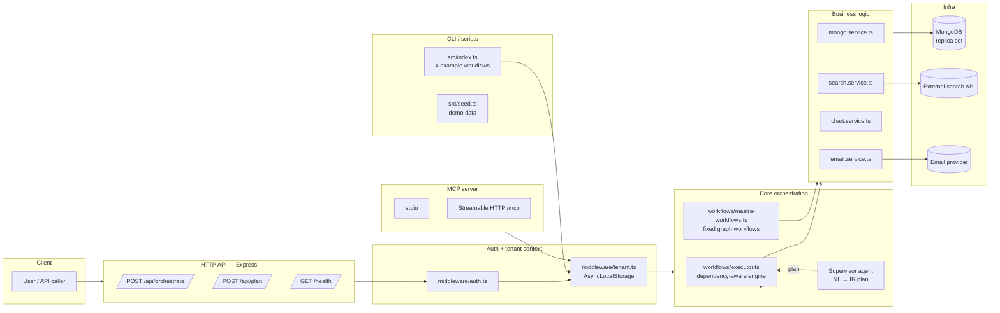
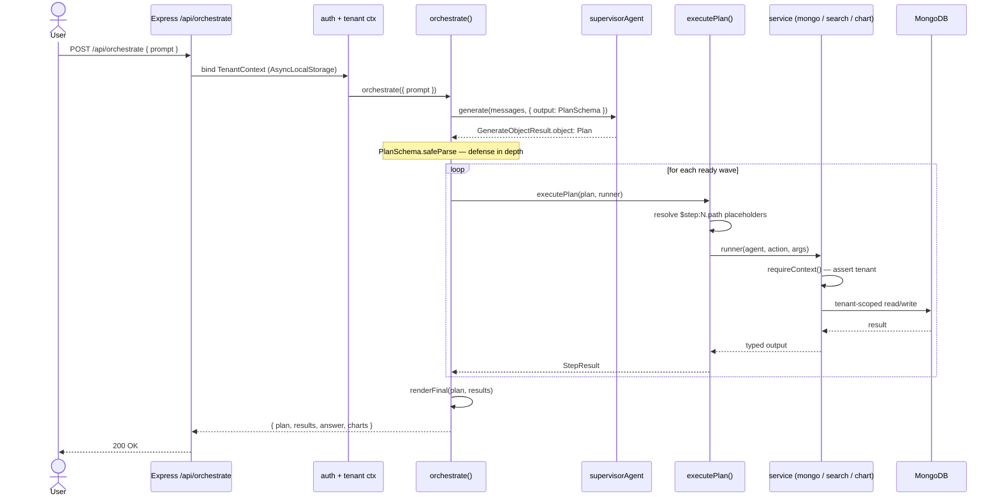
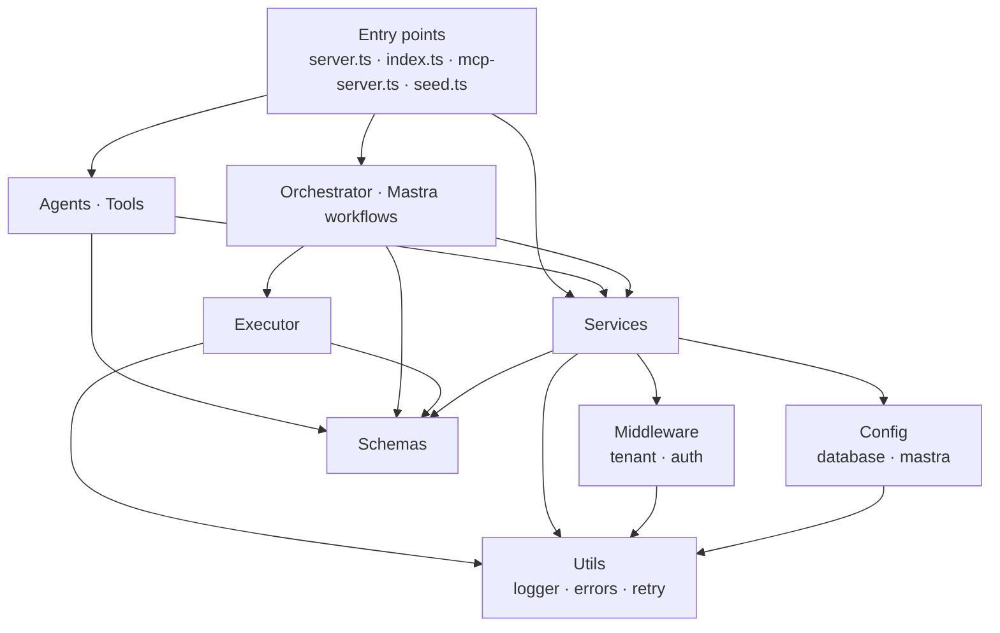

# Mastra Workflow Automation System

> A multi-agent workflow automation system built on [Mastra](https://mastra.ai). A **Supervisor** agent translates natural-language prompts into a typed **Intermediate Representation (IR)** plan; a deterministic orchestrator dispatches each step to specialized subagents (MongoDB, Search, Chart, Email). Multi-tenant, transactional, and resistant to LLM hallucination of IDs, filters, or tenant boundaries.

[]() []() []() []()

---

## Table of contents

1. [Overview](#1-overview)
2. [Why this design](#2-why-this-design)
3. [Architecture](#3-architecture)
4. [Quick start](#4-quick-start)
5. [Configuration](#5-configuration)
6. [Project layout](#6-project-layout)
7. [The agents](#7-the-agents)
8. [The IR plan format](#8-the-ir-plan-format)
9. [HTTP API reference](#9-http-api-reference)
10. [CLI reference](#10-cli-reference)
11. [MCP server](#11-mcp-server)
12. [Multi-tenancy](#12-multi-tenancy)
13. [Error handling and consistency](#13-error-handling-and-consistency)
14. [Testing](#14-testing)
15. [Extending the system](#15-extending-the-system)
16. [Operations: deployment, observability, security](#16-operations)
17. [Troubleshooting](#17-troubleshooting)
18. [FAQ](#18-faq)
19. [Roadmap and limitations](#19-roadmap-and-limitations)
20. [License](#20-license)

---

## 1. Overview

This repository implements a production-grade pattern for letting large language models drive real systems safely. The user types a natural-language request — *"Create a sales-forecast model on the sales_data dataset and chart this year's revenue by quarter"* — and the system:

1. **Plans** the work as a typed JSON object (the IR), validated against a Zod schema.
2. **Executes** the plan deterministically against MongoDB, search, charting, and email services — all tenant-scoped, transactional where it matters, retried on transient failures.
3. **Returns** a structured result: the plan it ran, every step's output, a final answer, and any rendered charts.

| Subagent | Backed by service | Purpose |
|---|---|---|
| `mongodb` | `mongoService` | CRUD, aggregation, and transactional `link` operations |
| `search`  | `searchService` | Internal Mongo text/vector search or external HTTP web search |
| `chart`   | `chartService` | Chart.js-compatible chart configs (+ optional QuickChart preview URLs) |
| `email`   | `emailService` | RBAC-gated email delivery (admin/operator only); stub or HTTP provider |

### When you'd use this

- **Internal tools** that take messy English instructions and produce structured side-effects (admin consoles, ETL kickoff, data setup).
- **Customer-facing assistants** that need to read/write multi-tenant data without ever leaking across tenants.
- **Batch automation** where a fixed graph workflow is preferable to LLM-planned IR (also supported — see [Mastra-native workflows](#fixed-graph-workflows)).
- **As a reference architecture** for splitting LLM planning from deterministic execution in any TypeScript codebase.

---

## 2. Why this design

The single most important design choice is the **split between planning (LLM) and execution (pure code)**. Concretely:

| Without the split | With the split |
|---|---|
| LLM tool-calls fire sequentially with no overall plan visible to the user | Plan is a JSON document the user can preview, save, audit, replay |
| LLM might invent IDs, filter values, or tenant identifiers | IR placeholders (`$step:N.path`) only resolve to real prior outputs; tenant scope is injected by code, not the LLM |
| Hard to test — every test path needs an LLM | Executor is pure: 17 unit tests cover scheduling, parallelism, placeholder resolution, partial-failure isolation |
| Retry/transaction logic gets entangled with prompt logic | All operational concerns live in services; agents stay declarative |
| No way to run the same flow on a schedule without the LLM | The same IR can be saved and replayed by the executor, no LLM needed |

This is the same pattern used by serious agent frameworks (LangGraph plans, AutoGen workflows, Mastra workflows). What's specific to this repo is making the IR **the canonical contract** — both the LLM-driven and graph-driven paths produce/consume the same shape.

---

## 3. Architecture

### Component map



### Request lifecycle



### Module dependency direction



The graph is one-way. **Services don't know about agents.** You can swap the supervisor LLM, the orchestrator engine, or even drop Mastra entirely without touching `services/*.ts`. Conversely, the agents and orchestrator can be reused with completely different services as long as the schemas hold.

For the full architecture deep-dive — including the tenant scoping defense-in-depth diagram and error classification flow — see [`docs/architecture.md`](./docs/architecture.md).

---

## 4. Quick start

### Prerequisites

- **Node.js 20+** ([nodejs.org](https://nodejs.org/))
- **Docker** ([docker.com/products/docker-desktop](https://www.docker.com/products/docker-desktop/)) — for the MongoDB replica set
- An **OpenAI API key** (or any model supported by the AI SDK — see [Configuration](#5-configuration))

### Option A — Docker Compose (recommended)

Spins up MongoDB (single-node replica set, auto-initialized) and the app together:

```bash
cp .env.example .env
# Set OPENAI_API_KEY in .env, the rest has sensible defaults
docker compose up --build
```

Open <http://localhost:3000> for the demo client. Pick a tenant, type a prompt, watch the system plan-then-execute, and see any charts rendered with Chart.js.

### Option B — Local dev (Mongo in Docker, app via Node)

```bash
# Terminal 1 — start MongoDB replica set
docker run -d --name mongo -p 27017:27017 mongo:7 --replSet rs0
docker exec mongo mongosh --eval "rs.initiate()"

# Terminal 2 — install deps, run the app
npm install
cp .env.example .env             # set OPENAI_API_KEY
npm run typecheck                # verify types
npm test                         # 63 pass; 6 mongo-integration skip without local mongod
npm run seed                     # populate demo data for tenants `acme` and `contoso`
npm run dev                      # tsx watch with reload on src/server.ts
```

### Windows specifics

```powershell
# PowerShell. Extract the zip, then:
cd mastra-workflow
npm install
copy .env.example .env
notepad .env                     # set OPENAI_API_KEY
npm test
docker compose up --build
```

If you hit `node_modules` path-length errors, enable long paths in an admin PowerShell:

```powershell
New-ItemProperty -Path "HKLM:\SYSTEM\CurrentControlSet\Control\FileSystem" `
  -Name "LongPathsEnabled" -Value 1 -PropertyType DWORD -Force
```

### First request

```bash
curl -X POST http://localhost:3000/api/orchestrate \
  -H "Content-Type: application/json" \
  -H "X-Tenant-Id: acme" \
  -H "X-User-Id: alice" \
  -H "X-Roles: admin" \
  -d '{"prompt": "Show me 2025 revenue by quarter as a bar chart"}'
```

You'll get back a plan, results, a final answer, and a Chart.js config you can render directly.

---

## 5. Configuration

All configuration is via environment variables. See [`.env.example`](./.env.example) for the canonical list.

### LLM provider

```bash
OPENAI_API_KEY=sk-...
LLM_MODEL=gpt-4o-mini   # any structured-output-capable model
```

The supervisor uses Mastra's `output: PlanSchema` option, which requires structured-output support. `gpt-4o-mini` is cheap and fast; `gpt-4o` or Claude 3.5 Sonnet via `@ai-sdk/anthropic` produce better plans for complex prompts.

To swap providers, edit `src/agents/supervisor.agent.ts` and replace the `model` line:

```ts
import { anthropic } from '@ai-sdk/anthropic';
// ...
model: anthropic('claude-3-5-sonnet-20241022'),
```

### MongoDB

```bash
MONGODB_URI=mongodb://localhost:27017/?replicaSet=rs0
MONGODB_DB_PREFIX=app
TENANCY_STRATEGY=shared    # or "isolated"
```

A **replica set is required** because the `link` action uses transactions. Single-node replica sets work fine for development.

### Search and email

```bash
SEARCH_API_URL=            # leave blank for stub (returns [])
SEARCH_API_KEY=
EMAIL_PROVIDER_URL=        # leave blank for stub (logs and returns success)
EMAIL_PROVIDER_KEY=
```

Both fall back to safe stubs when unset, so the demo runs without external creds.

### Server

```bash
PORT=3000
LOG_LEVEL=info             # trace | debug | info | warn | error | fatal
```

### MCP server (optional)

```bash
MCP_TRANSPORT=stdio        # or "http"
MCP_PORT=3333              # for http transport
MCP_TENANT_ID=default      # for stdio: bind tenant for the connection's lifetime
MCP_USER_ID=
MCP_ROLES=admin
```

---

## 6. Project layout

```
src/
  agents/                    Mastra Agent definitions (system prompt + tool wiring)
    supervisor.agent.ts      Plans NL → IR via output: PlanSchema
    mongo.agent.ts           Calls mongoTool — used in conversational mode
    search.agent.ts          Calls searchTool
    chart.agent.ts           Calls chartTool
    email.agent.ts           Calls emailTool — RBAC-gated
  tools/                     createTool() wrappers around the services
    mongo.tool.ts            Schema-validated entry point for the MongoDB service
    search.tool.ts           Schema-validated entry point for the search service
    chart.tool.ts            Schema-validated entry point for the chart service
    email.tool.ts            Schema-validated entry point for the email service
  services/                  Business logic — the only modules that touch infra
    mongo.service.ts         CRUD + transactional link + aggregation + tenant scoping
    search.service.ts        Internal text + vector + web search
    chart.service.ts         Chart.js config generation
    email.service.ts         Email send with RBAC + retry
  schemas/                   The cross-module Zod contracts
    ir.ts                    Plan, PlanStep, StepResult, AgentName
    agents.ts                Per-agent input/output schemas
  workflows/
    orchestrator.ts          NL → plan → execute glue
    orchestrator.helpers.ts  planOnly() for /api/plan endpoint
    executor.ts              Pure execution engine (deps · parallelism · placeholders)
    mastra-workflows.ts      Fixed-graph Mastra workflows (alternative to IR)
  middleware/
    tenant.ts                AsyncLocalStorage tenant context, scopeFilter, requireRole
    auth.ts                  Express middleware that binds the context from headers
  config/
    database.ts              Mongo client, transactions, per-tenant DB resolution
    mastra.ts                The single Mastra instance — registers agents + workflows
  utils/
    logger.ts                pino logger with redaction for sensitive fields
    errors.ts                AppError hierarchy + classifyMongoError
    retry.ts                 Exponential backoff + jitter, retriable-aware
  app.ts                     Express app factory (testable)
  server.ts                  Production server entry — boots app + signal handling
  mcp-server.ts              MCP stdio + Streamable HTTP transports
  index.ts                   CLI runner for the four canonical example workflows
  seed.ts                    Demo data + text indexes for two tenants

tests/                       63 vitest tests + 6 integration (skip if no Mongo)
docs/architecture.md         Diagrams, flows, and module dependency map
public/index.html            Browser demo client
```

---

## 7. The agents

### Supervisor (`src/agents/supervisor.agent.ts`)

The top-level coordinator. Two modes:

1. **Planning mode** (used by `orchestrate()`) — call `.generate()` with `output: PlanSchema` to produce an IR plan that the executor runs deterministically.
2. **Conversational fallback** — call `.generate()` without `output` for free-form replies. Useful for prompts that don't decompose cleanly into a plan.

The system prompt instructs the supervisor about the available subagents, the placeholder syntax, and the rules (no inventing IDs, no including `tenantID` in filters).

### MongoDB agent (`src/agents/mongo.agent.ts`)

Wraps the `mongo` tool. Useful for conversational follow-ups like *"how many models do we have?"* — the orchestrator usually calls the underlying tool directly since the IR already specifies the action.

### Search agent (`src/agents/search.agent.ts`)

Picks between `internal` (Mongo $text), `vector` (Atlas $vectorSearch), or `web` (external HTTP) search.

### Chart agent (`src/agents/chart.agent.ts`)

Picks the right chart type for the data shape (bar/line for time series, pie/doughnut for parts of a whole, etc.) and produces a Chart.js config.

### Email agent (`src/agents/email.agent.ts`)

Sends transactional email. Demonstrates the extensibility pattern — service-level RBAC (`requireRole('admin', 'operator')`), retry policy, stub fallback.

---

## 8. The IR plan format

The IR is a JSON object validated against `PlanSchema` (`src/schemas/ir.ts`):

```ts
{
  summary: string;            // human-readable one-liner
  steps: PlanStep[];          // ordered list of work items
  finalTemplate?: string;     // optional response template with $step:N.path refs
}

interface PlanStep {
  id: number;                 // 1-based; used for placeholder refs
  agent: 'mongodb' | 'search' | 'chart' | 'email';
  action: string;             // agent-specific verb (e.g. "create", "query", "link")
  args: Record<string, unknown>;
  rationale?: string;         // one-line explanation, surfaced in logs
  parallelizable?: boolean;   // run with siblings concurrently?
  dependsOn?: number[];       // step IDs that must succeed first
}
```

### Placeholder syntax

Any string in `args` of the form `$step:N.path` is replaced with the value at that path in step `N`'s output. Paths support dotted notation and array indices: `result[0]._id`, `result.0._id`, `insertedId`.

**Type preservation:** placeholders only substitute when they are the *entire* string. So `$step:1.insertedId` becomes the actual string ID, but `prefix-$step:1.insertedId` stays literal. This is intentional — it keeps array results as arrays, ObjectIds as ObjectIds, etc.

### Example: create dataset, then link to a model

```json
{
  "summary": "Create dataset and link it to SalesForecast",
  "steps": [
    {
      "id": 1,
      "agent": "mongodb",
      "action": "create",
      "args": {
        "collection": "Datasets",
        "data": { "name": "sales_data", "source": "file.csv" }
      },
      "rationale": "Insert the new dataset.",
      "dependsOn": []
    },
    {
      "id": 2,
      "agent": "mongodb",
      "action": "query",
      "args": {
        "collection": "Models",
        "query": { "name": "SalesForecast" },
        "options": { "limit": 1 }
      },
      "rationale": "Look up the existing model.",
      "parallelizable": true,
      "dependsOn": []
    },
    {
      "id": 3,
      "agent": "mongodb",
      "action": "link",
      "args": {
        "collection": "Relationships",
        "data": {
          "from": "Models",
          "to": "Datasets",
          "fromId": "$step:2.result[0]._id",
          "toId": "$step:1.insertedId",
          "relation": "uses"
        }
      },
      "rationale": "Link the model to the dataset (transactional).",
      "dependsOn": [1, 2]
    }
  ],
  "finalTemplate": "Linked dataset $step:1.insertedId to model $step:2.result[0]._id (rel $step:3.insertedId)."
}
```

### Execution semantics

- A step is **ready** when every ID in its `dependsOn` has produced a successful result.
- Within a wave, `parallelizable: true` steps run concurrently (`Promise.all`).
- Non-parallelizable steps run sequentially in plan order.
- If a step fails, **its dependents** are marked `DEPENDENCY_FAILED` — but **independent branches still execute**. Partial successes are returned.
- A step's `args` go through placeholder substitution, then **per-agent Zod validation**, then to the service. The LLM cannot bypass either layer.

---

## 9. HTTP API reference

All `/api/*` endpoints require these headers:

| Header | Required | Default | Purpose |
|---|---|---|---|
| `X-Tenant-Id` | yes | — | Tenant identifier; binds tenant scope for the whole request |
| `X-User-Id` | no | — | Caller's user ID; surfaces in logs |
| `X-Roles` | no | `viewer` | Comma-separated role list (e.g. `admin,analyst`) |
| `X-Request-Id` | no | random UUID | Correlation ID; echoed in the response |

### `GET /health`

Liveness probe. Returns `{ ok: true, service, uptime }` with no auth.

### `POST /api/orchestrate`

Full NL → plan → execute pipeline.

**Request:**
```json
{ "prompt": "Create a new model called SalesForecast on the sales_data dataset" }
```

Or supply a pre-built plan (skips the LLM step):

```json
{ "plan": { "summary": "...", "steps": [...] } }
```

Optional `history`: an array of `{ role: 'user' | 'assistant', content: string }` messages for multi-turn prompts.

**Response:**
```json
{
  "plan":    { "summary": "...", "steps": [...], "finalTemplate": "..." },
  "results": [
    { "stepId": 1, "agent": "mongodb", "action": "create", "ok": true, "output": {...}, "durationMs": 23 }
  ],
  "answer":  "Created model with id 65f...",
  "charts":  [ { "stepId": 4, "config": { ... }, "imageUrl": "https://..." } ]
}
```

### `POST /api/plan`

Planning only — returns the IR without executing it. Use this when you want a human (or another system) to approve the plan before any side-effects run.

**Request:** `{ "prompt": "..." }`
**Response:** `{ "plan": {...} }`

### Error responses

All errors are JSON: `{ "error": { "code": "...", "message": "...", "retriable": bool, "details": ... } }`.

| HTTP status | When |
|---|---|
| 400 | Validation failure (missing/empty prompt, malformed plan, schema mismatch) |
| 401 | Missing `X-Tenant-Id` |
| 403 | Caller's roles insufficient (e.g. trying to send email without `admin`/`operator`) |
| 404 | `NOT_FOUND` from the application |
| 409 | Duplicate key (Mongo error 11000) |
| 422 | Plan parsing failed (the supervisor returned invalid JSON) |
| 500 | Unhandled error — surfaced as `INTERNAL` |
| 503 | Transient DB issue or retry exhaustion |

---

## 10. CLI reference

```bash
npm run cli -- 1                 # Create a model (example #1 from the design doc)
npm run cli -- 2                 # Create a dataset and link to a model
npm run cli -- 3                 # Establish a one-to-many relationship
npm run cli -- 4                 # Search + bar chart pipeline
npm run cli -- custom "your free-form prompt"
```

Set `DEMO_TENANT_ID` and `DEMO_USER_ID` env vars to override the defaults (`demo-tenant` / `demo-user`).

### Other scripts

| Command | Purpose |
|---|---|
| `npm run dev` | Express server with `tsx watch` — hot reload on changes |
| `npm run build` | Compile TypeScript to `dist/` |
| `npm start` | Run the compiled server |
| `npm run typecheck` | `tsc --noEmit` |
| `npm test` | vitest run — 63 tests, 6 skip without Mongo |
| `npm run seed` | Populate demo data for `acme` and `contoso` tenants |
| `npm run seed -- --reset` | Wipe tenant data first |
| `npm run seed -- --tenant=acme` | Seed only one tenant |
| `npm run mcp` | Start MCP server on stdio |
| `npm run mcp:http` | Start MCP server on HTTP at `:3333/mcp` |

---

## 11. MCP server

The system can expose its tools (mongo, search, chart, email) as a [Model Context Protocol](https://modelcontextprotocol.io) server, so any MCP client — Claude Desktop, another Mastra agent, an external orchestrator — can use them as a microservice.

### Stdio (Claude Desktop)

Add to your Claude Desktop config (`~/Library/Application Support/Claude/claude_desktop_config.json` on macOS, `%APPDATA%\Claude\claude_desktop_config.json` on Windows):

```json
{
  "mcpServers": {
    "mastra-workflow": {
      "command": "npx",
      "args": ["tsx", "/absolute/path/to/mastra-workflow/src/mcp-server.ts"],
      "env": {
        "OPENAI_API_KEY": "sk-...",
        "MONGODB_URI": "mongodb://localhost:27017/?replicaSet=rs0",
        "MCP_TENANT_ID": "acme",
        "MCP_ROLES": "admin"
      }
    }
  }
}
```

### Streamable HTTP

```bash
MCP_TRANSPORT=http MCP_PORT=3333 npm run mcp
```

Clients POST JSON-RPC to `http://localhost:3333/mcp` with these headers:

```
X-Tenant-Id: acme
X-User-Id: alice
X-Roles: admin
```

Each request gets its own session and tenant context — no leakage between concurrent callers.

---

## 12. Multi-tenancy

Tenancy is enforced in **three layers**, deliberately. Any one alone would be insufficient.

### Layer 1: HTTP middleware

`src/middleware/auth.ts` rejects requests with no `X-Tenant-Id`, then calls `runWithContext` to bind a `TenantContext` to AsyncLocalStorage for the entire request.

### Layer 2: AsyncLocalStorage

`src/middleware/tenant.ts` exports `requireContext()` — every service entry point calls it. If no context is bound, you get a `TenantForbiddenError` immediately. There's no way to call a service without first being inside a `runWithContext` block.

### Layer 3: Service-level scoping

`scopeFilter()` and `stampTenant()` are the gatekeepers for filters and writes:

```ts
// scopeFilter strips ANY caller-supplied tenantID/tenantId (even from an LLM
// that "knows" about scoping) before injecting the canonical one from context.
const filter = scopeFilter({ tenantID: 'evil', name: 'X' });
// → { tenantID: <bound-tenant>, name: 'X' }   // 'evil' is dropped
```

For aggregation, the service **prepends** a `$match` stage rather than merging into a user-supplied stage — an LLM cannot put it in a wrong position.

### Strategies

`TENANCY_STRATEGY` selects one of two patterns:

#### `shared` (default)

One MongoDB database, every document carries a `tenantID` field, every read/write filter is augmented automatically.

- ✅ Simple operations, single connection pool, easy cross-tenant analytics
- ✅ Scales horizontally via shard key on `tenantID`
- ⚠️ All tenants share an index/cache — noisy-neighbor risk

#### `isolated`

Each tenant gets its own database (`<prefix>_<tenantId>`).

- ✅ Stronger blast-radius isolation; per-tenant backup/restore is trivial
- ✅ MongoDB users can be locked to a single DB via native RBAC
- ⚠️ Capped by Mongo's collection/database limits (~10k per cluster)
- ⚠️ Higher operational overhead — each tenant DB needs indexes

The `mongoService` automatically applies the right strategy. Switching is a config-only change.

### RBAC

Within a tenant, `requireRole('admin')` etc. enforces role-based authorization at the service layer:

```ts
// In email.service.ts
requireRole('admin', 'operator');   // throws TenantForbiddenError otherwise
```

Roles come from the `X-Roles` header (or `MCP_ROLES` for the MCP server). Replace the header parsing with real JWT verification before deploying.

---

## 13. Error handling and consistency

### Error hierarchy (`src/utils/errors.ts`)

```
AppError (base)
├── ValidationError       (400, not retriable)
├── TenantForbiddenError  (403, not retriable)
├── AuthRequiredError     (401, not retriable)
├── TransientDbError      (503, retriable)
└── PlanParseError        (422, not retriable)
```

`classifyMongoError()` maps low-level driver errors:

- `TransientTransactionError` label → retriable `TRANSACTION_ABORTED`
- `UnknownTransactionCommitResult` label → retriable `WRITE_CONCERN_TIMEOUT`
- Code 11000 → non-retriable `CONFLICT`
- Everything else → retriable `TransientDbError`

### Retry policy (`src/utils/retry.ts`)

Exponential backoff with full jitter. Default: 3 attempts, 100ms base, 2s max.

```ts
await withRetry(() => fn(), { maxAttempts: 5, baseDelayMs: 200 });
```

**Only retries `AppError`s flagged `retriable`** — validation, auth, and permission errors are NEVER retried. Retrying them just delays the inevitable failure.

### MongoDB transactions

The `link` action wraps both writes (relationship doc + counter bumps on both endpoints) in a transaction:

```ts
await session.withTransaction(fn, {
  readConcern:  { level: 'snapshot' },
  writeConcern: { w: 'majority', wtimeoutMS: 5000 },
  readPreference: 'primary',
});
```

The driver retries `TransientTransactionError` and `UnknownTransactionCommitResult` automatically. The application layer adds another layer via `withRetry`. Both fire-and-forget — you cannot end up with a half-committed link.

### Failure isolation in plans

When a step in an IR plan fails:

- Steps that **depend** on it (transitively) are marked `DEPENDENCY_FAILED` without running.
- Steps in **independent branches** still execute. Partial successes are returned.
- The final response includes `ok: false` for failed steps with a structured `error.code` and `error.message`.

---

## 14. Testing

```bash
npm test                                                          # full suite
npx vitest run tests/executor.test.ts                             # one file
TEST_MONGODB_URI="mongodb://localhost:27017/?replicaSet=rs0" \
  npm test                                                        # incl. integration
```

### Test files

| File | What it covers |
|---|---|
| `executor.test.ts` (17) | Placeholder resolution, dependency ordering, parallelism, partial-failure isolation, `renderFinal` |
| `example-plans.test.ts` (3) | The four canonical workflows from the design doc, run end-to-end with stubbed runners |
| `tenant.test.ts` (6) | Context binding, scope-filter hardening (rejects both `tenantID` and `tenantId` overrides), role checks, async-locality |
| `retry.test.ts` (5) | Exponential backoff, retry-only-when-retriable |
| `chart.service.test.ts` (4) | Chart.js config shape, palette defaults, QuickChart URL bounds |
| `email.service.test.ts` (5) | RBAC enforcement (admin/operator allowed, viewer rejected), stub-provider behavior |
| `ir.schema.test.ts` (4) | IR Zod schema invariants |
| `seed.test.ts` (6) | Seed-data shape consistency |
| `server.test.ts` (13) | Supertest-driven HTTP coverage: auth, validation, error mapping, request-id propagation |
| `integration.mongo.test.ts` (6, *skipped without Mongo*) | Real-Mongo tests: tenant isolation, malicious-filter stripping, transactional `link`, aggregation tenant scoping |

The integration suite skips cleanly with a logged reason if no Mongo is reachable, so `npm test` always passes — even offline.

### Two real bugs the tests caught during development

1. **`scopeFilter` accepted caller-supplied `tenantId`** (lowercase) as a sneak-through past the `tenantID` (canonical case) stripping. Now strips both casings.
2. **Malformed plans returned 500** because `PlanSchema.parse()` throws `ZodError` which the catch-all error mapper hit. Switched to `safeParse` and a 400 response with the flattened error details.

---

## 15. Extending the system

### Adding a new agent

It's a **five-file change**. As an example, here's how the existing email agent was added:

**1. Schema** — `src/schemas/agents.ts`:
```ts
export const EmailToolInputSchema = z.object({
  to: z.string().email(),
  subject: z.string(),
  body: z.string(),
  // ... cc, bcc, html, replyTo
});
export const EmailToolOutputSchema = z.object({
  success: z.boolean(),
  messageId: z.string(),
  stubbed: z.boolean(),
});
```

**2. Service** — `src/services/email.service.ts`:
```ts
export const emailService = {
  async execute(input: EmailToolInput): Promise<EmailToolOutput> {
    requireRole('admin', 'operator');   // RBAC at service layer
    // ... call email provider with retry
  },
};
```

**3. Tool** — `src/tools/email.tool.ts`:
```ts
export const emailTool = createTool({
  id: 'email',
  description: 'Send a transactional email...',
  inputSchema: EmailToolInputSchema,
  outputSchema: EmailToolOutputSchema,
  execute: async ({ context }) => emailService.execute(context),
});
```

**4. Agent** — `src/agents/email.agent.ts`:
```ts
export const emailAgent = new Agent({
  name: 'emailAgent',
  description: 'Sends transactional email.',
  instructions: `You send transactional emails. ...`,
  model: openai(MODEL),
  tools: { email: emailTool },
});
```

**5. Wiring** — register in `src/config/mastra.ts`, add to `AgentNameSchema` in `src/schemas/ir.ts`, and add a case in `productionRunner` in `src/workflows/orchestrator.ts`.

Then update the supervisor's instructions to mention when to choose the new agent.

### <a id="fixed-graph-workflows"></a>Fixed-graph workflows (Mastra-native)

For predictable jobs (scheduled reports, onboarding, ETL), a Mastra-native graph workflow is a better fit than LLM-planned IR. See `src/workflows/mastra-workflows.ts` for two examples:

- `createDatasetAndLinkWorkflow` — sequential 4-step graph with typed I/O between steps and per-step retries (the same operation as IR example #2, but in fixed-graph form)
- `dualSearchWorkflow` — `.parallel([internalSearch, webSearch])` for fan-out

```ts
const result = await mastra.getWorkflow('createDatasetAndLink')
  .createRun()
  .start({
    inputData: { datasetName: 'sales_q1', source: 'file.csv', targetModelName: 'SalesForecast' },
  });
```

These workflows show up in the Mastra playground / API alongside the agents.

---

## 16. Operations

### Deployment

The included `Dockerfile` produces a multi-stage image (build → runtime) with `node:20-alpine`. The compose file wires it to a Mongo replica set with health checks.

For Kubernetes, the app is fully stateless — multiple replicas are safe behind a load balancer. Two important details:

1. **Sticky sessions are NOT required** — every request reads `X-Tenant-Id` headers, so any pod can serve any request.
2. **Graceful shutdown** is wired up: `SIGTERM` causes the server to stop accepting new connections, drain in-flight requests, close the Mongo client, then exit (with a 10s force-exit fallback).

### Observability

The system emits structured pino logs. Every entry includes:

- `tenantId` — bound from the request context
- `requestId` — auto-generated or from `X-Request-Id`
- `agent` — which subagent / orchestrator stage emitted the log
- `durationMs` for completed operations

Secrets (`*.password`, `*.apiKey`, `req.headers.authorization`) are auto-redacted by pino.

For traces, integrate OpenTelemetry by replacing the Mastra `logger: false` setting in `src/config/mastra.ts` with a real OTel-compatible logger — Mastra emits trace spans for every agent invocation and tool call.

### Security checklist before deploying

- [ ] Replace the header-based `auth.ts` with real JWT verification (Auth0, Clerk, Cognito, etc.)
- [ ] Set `OPENAI_API_KEY` via a secrets manager, not env file
- [ ] Use TLS for Mongo (`mongodb+srv://` or `?tls=true`)
- [ ] Enable Mongo authentication (`--auth` or Atlas built-in)
- [ ] If using `isolated` strategy, create per-tenant Mongo users with database-scoped roles
- [ ] Set `LOG_LEVEL=info` (not `debug`) in production to avoid logging full payloads
- [ ] Add rate limiting at the LB / API gateway — the supervisor's LLM calls are the most expensive and easiest to abuse
- [ ] Set `MAX_BODY_SIZE` lower than the current `1mb` if appropriate

### Cost considerations

- **LLM calls**: 1 per `/api/orchestrate` request (planning) + ~0 for execution (services are pure code). With `gpt-4o-mini`, expect $0.0001–0.0005 per request for typical prompts.
- **MongoDB**: writes go to majority for transactions; this is the most expensive part of `link` actions. For high-throughput non-critical writes, override the write concern via service options.
- **QuickChart preview URLs**: free for small images (~1500 char URL limit). Beyond that, the service returns just `chartConfig` for client-side rendering.

---

## 17. Troubleshooting

### `MongoError: Transaction numbers are only allowed on a replica set member or mongos`

You're connected to a standalone Mongo. Either:

```bash
docker run -d --name mongo -p 27017:27017 mongo:7 --replSet rs0
docker exec mongo mongosh --eval "rs.initiate()"
```

…or set `MONGODB_URI=mongodb+srv://...` to an Atlas cluster.

### `OpenAIError: 401 Incorrect API key`

`OPENAI_API_KEY` not set in `.env`, or pointing at a key that's been rotated.

### `Plan parse error: required at "summary"`

The supervisor returned text that didn't parse as `PlanSchema`. Most common causes:

- Using a model that doesn't support structured output (`gpt-3.5-turbo-instruct`, etc.)
- Prompt was too vague — supervisor tried to ask a clarifying question instead of producing a plan
- Token limit hit mid-output

Switch to `gpt-4o-mini` or a similarly capable model, and make the prompt more specific.

### `TenantForbiddenError: No tenant context bound`

You're calling a service from outside an `runWithContext` block. In tests, wrap calls:

```ts
await runWithContext({ tenantId: 'test', roles: ['admin'], requestId: 'r' }, async () => {
  await mongoService.execute({...});
});
```

### Integration tests skip with "Download failed"

`mongodb-memory-server` couldn't reach `fastdl.mongodb.org`. Either:

- Run the tests on a network with access to MongoDB's CDN, or
- Provide a real Mongo URL: `TEST_MONGODB_URI=mongodb://localhost:27017/?replicaSet=rs0 npm test`

### `EADDRINUSE: address already in use :::3000`

Another process is on port 3000. Either kill it, or set `PORT=3001` in `.env`.

### Windows: `node_modules` install fails with path-too-long errors

Enable long paths (admin PowerShell, then reboot):

```powershell
New-ItemProperty -Path "HKLM:\SYSTEM\CurrentControlSet\Control\FileSystem" `
  -Name "LongPathsEnabled" -Value 1 -PropertyType DWORD -Force
```

---

## 18. FAQ

**Q: Can I use this without OpenAI?**
A: Yes. Mastra builds on the AI SDK, which supports Anthropic, Google, Groq, Bedrock, Azure OpenAI, Ollama, and more. Edit `src/agents/supervisor.agent.ts` and replace the `model:` line. The model needs to support structured output (most modern frontier models do).

**Q: Can I use a database other than MongoDB?**
A: The service layer is the only place that touches Mongo. Replace `mongo.service.ts` with a Postgres/SQLite/etc. implementation that satisfies the same I/O contract from `schemas/agents.ts`. The orchestrator, executor, agents, and tests don't need to change.

**Q: How do I run multiple tenants in parallel without a header?**
A: For server-side jobs (cron, queue workers), call `runWithContext({...}, async () => orchestrate({...}))` directly. Each invocation gets its own AsyncLocalStorage scope, so concurrent runs in the same Node process don't interfere.

**Q: Can the supervisor make tool calls directly instead of producing a plan?**
A: Yes — that's the "conversational mode" mentioned in the agents section. Drop the `output: PlanSchema` option and the supervisor will use the AI SDK's tool-call loop. You lose the auditability and replay-ability of the IR, so use it sparingly.

**Q: How do I hand-write a plan instead of using the LLM?**
A: POST to `/api/orchestrate` with `{ "plan": {...} }` instead of `{ "prompt": "..." }`. The orchestrator skips planning and runs the supplied plan directly. Useful for testing, scheduled jobs, and replays.

**Q: What's the difference between IR-driven and Mastra-native workflows?**
A: IR-driven plans are produced by the LLM at request time; Mastra workflows are coded by hand. Use IR for user-facing prompts where the shape is unpredictable; use Mastra workflows for fixed business processes you want versioned in source control. Both call the same services.

**Q: How do I add streaming to the API?**
A: Mastra's `agent.stream()` returns an `AsyncIterable<TextStreamPart>`. The simplest integration: change `/api/orchestrate` to use Server-Sent Events and emit each step's start/finish event. Add a corresponding event type to `StepResult`.

---

## 19. Roadmap and limitations

### Known limitations

- **Auth middleware is header-based.** Replace with real JWT/OIDC verification before deploying.
- **Web search and email** fall back to stubs when no provider is configured. Wire in real backends via the env vars in [`.env.example`](./.env.example).
- **Vector search** uses a deterministic hash-based pseudo-embedding when no embedding provider is configured. Wire in OpenAI embeddings before relying on `type: 'vector'`.
- **No user-facing UI for plan approval.** The `/api/plan` endpoint returns the plan; a "review and execute" UI is left to consumers.
- **Single-region MongoDB only.** Multi-region writes need additional coordination not modeled here.

### Planned

- [ ] OpenTelemetry tracing integration for end-to-end span propagation
- [ ] Plan caching — when the same prompt produces the same plan twice, skip the LLM call
- [ ] Streaming responses (SSE) so the UI can render step-by-step progress
- [ ] Plan replay tool — dump a plan from a past request, re-run it (idempotent or with `--apply`)
- [ ] Cost ceilings — per-tenant LLM token quotas, returned in the response

---

## 20. License

MIT. See [LICENSE](./LICENSE) for the full text.

---

## Acknowledgements

Built on:

- [Mastra](https://mastra.ai) — TypeScript agent framework with structured output, tool calling, and graph workflows
- [Vercel AI SDK](https://sdk.vercel.ai) — provider-agnostic LLM client
- [MongoDB Node.js Driver](https://www.mongodb.com/docs/drivers/node/) — replica set transactions and retryable writes
- [Zod](https://zod.dev) — schemas for the IR and every agent contract
- [Model Context Protocol SDK](https://modelcontextprotocol.io) — for the optional MCP server export
- [Express](https://expressjs.com), [pino](https://getpino.io), [vitest](https://vitest.dev), [supertest](https://github.com/ladjs/supertest)

If you build something interesting on top of this, [open an issue](https://github.com/your-org/mastra-workflow/issues) — happy to link to it.
"# Mastra-workflow" 
