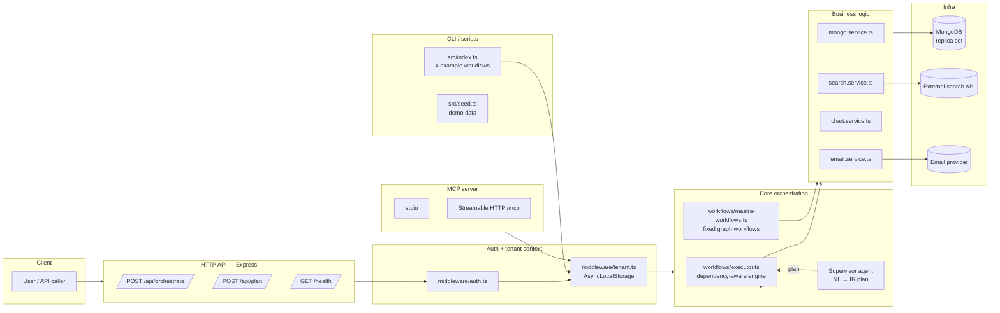
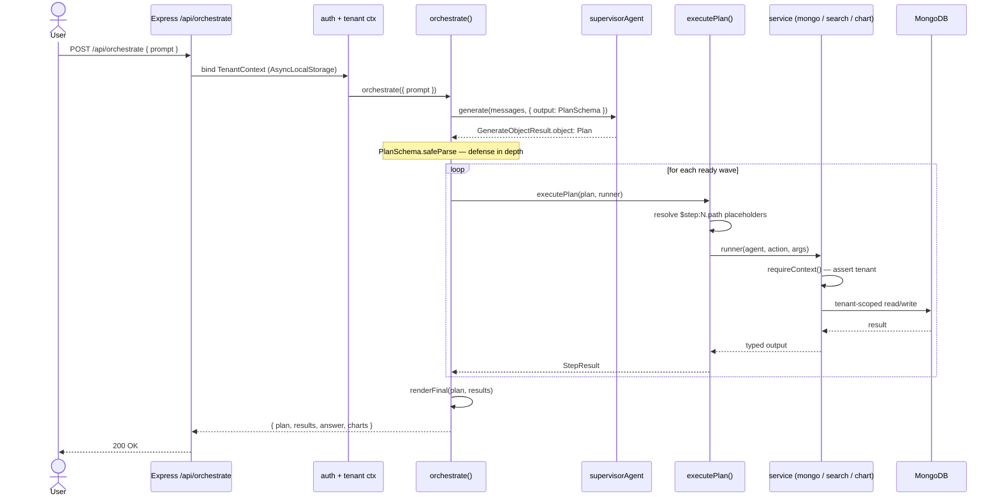
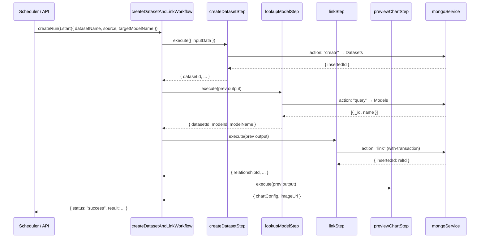
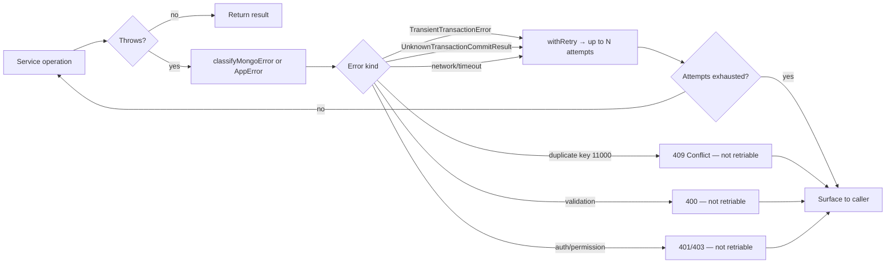
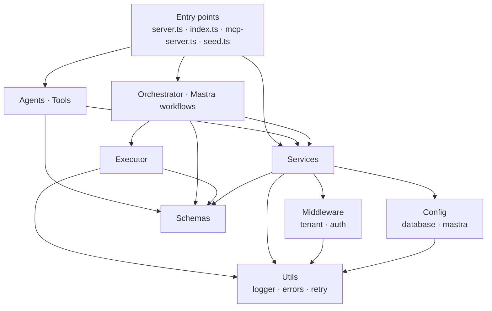

# Architecture

This document explains how the system is wired together. It mirrors the design doc but reflects what the code actually does — including a few choices the code made that the spec left open.

---

## Component map



The lines that matter:

* Every entry point (HTTP, CLI, MCP) goes through tenant context binding before touching any service.
* The supervisor only **plans**. The executor only **executes**. They communicate via the IR (a typed JSON object).
* Services own all infra access. Agents/tools/orchestrator never call MongoDB directly.

---

## Request flow — IR-driven path

This is what `POST /api/orchestrate` does on a fresh natural-language prompt:



Two safety properties this flow gives you:

1. **The LLM never sees tenantID.** It comes from the request, not the prompt.
2. **The LLM cannot bypass scoping.** The runner re-validates every step's args against the agent's Zod schema, and the service strips any `tenantID` / `tenantId` keys from filters before injecting the canonical one.

---

## Request flow — fixed graph path (Mastra-native workflow)

For predictable, repeatable jobs (scheduled reports, onboarding, ETL), the Mastra-native graph workflow is a better fit than an LLM-planned IR:



Per-step `retries: N` (declared on `createStep`) handle transient failures without polluting the business logic. The Mongo driver also retries `TransientTransactionError` internally, so `linkStep` is doubly resilient.

---

## Tenant scoping — three layers of defense

Tenancy is enforced in three places, deliberately. Any one alone would be insufficient:

```mermaid
flowchart TD
    REQ[Inbound request] --> H1{Header check<br/>X-Tenant-Id present?}
    H1 -- no --> R401[401 Unauthorized]
    H1 -- yes --> ALS[runWithContext bound to AsyncLocalStorage]
    ALS --> SVC[Service entry]
    SVC --> RC{requireContext()}
    RC -- no ctx --> R403[TenantForbiddenError]
    RC -- ctx --> SCOPE[scopeFilter / stampTenant]
    SCOPE --> STRIP[Strip caller-supplied<br/>tenantID + tenantId]
    STRIP --> INJECT[Inject canonical tenantID]
    INJECT --> AGG{Aggregation?}
    AGG -- yes --> PREP[Prepend $match tenantID<br/>before user pipeline]
    AGG -- no --> EXEC[Execute against MongoDB]
    PREP --> EXEC
```

Three layers:

1. **Auth middleware** rejects requests with no `X-Tenant-Id` header.
2. **AsyncLocalStorage** propagates the context across every async boundary; services that try to run without one get a `TenantForbiddenError`.
3. **`scopeFilter` / `stampTenant`** strip any caller-supplied tenant key (in either casing) before injecting the bound one. For aggregation, we **prepend** a `$match` rather than merging into a user-supplied stage — an LLM cannot put it in a wrong position.

The integration tests directly exercise these: see `integration.mongo.test.ts` (cross-tenant isolation, malicious `tenantID` filter rejection, aggregation leak prevention).

---

## Error model



Key invariants from the code:

* **`AppError.retriable` is the single source of truth** for whether to retry.
* **Validation, auth, and permission errors are NEVER retried** — retries on them just delay the inevitable failure.
* In the IR executor, **a single failed step does not abort independent branches** — `executePlan` marks dependents `DEPENDENCY_FAILED` but lets unrelated parallel steps complete.

---

## Module dependency direction

The codebase has a strict, one-way dependency graph. Reading top-down, each layer can only import from layers below it.



Why this matters: **services don't know about agents**. You can swap the supervisor LLM, the orchestrator engine, or even drop Mastra entirely without touching `services/*.ts`. Conversely, the agents/tools/orchestrator can be reused with completely different services as long as the schemas hold.

---

## Schema contracts

Every cross-module interface is a Zod schema. There are exactly five:

| Schema | Producer | Consumer | Purpose |
|---|---|---|---|
| `PlanSchema` | Supervisor agent | Orchestrator | The IR — what to do, in what order |
| `MongoToolInputSchema` / `OutputSchema` | Orchestrator runner / Mastra step | mongoService | DB operations |
| `SearchToolInputSchema` / `OutputSchema` | Orchestrator runner / Mastra step | searchService | Information retrieval |
| `ChartToolInputSchema` / `OutputSchema` | Orchestrator runner / Mastra step | chartService | Chart.js configs |
| `EmailToolInputSchema` / `OutputSchema` | Orchestrator runner / Mastra step | emailService | Outbound email |

Adding a sixth agent is a five-file change: schema, service, tool, agent, and one new case in the orchestrator's `productionRunner` switch + one new entry in `AgentNameSchema`. The supervisor's instructions also need to be updated so it knows when to choose the new agent.

---

## What lives where (one-line summary per file)

| Path | Role |
|---|---|
| `src/agents/*.agent.ts` | Mastra `Agent` definitions — system prompt + tool wiring |
| `src/tools/*.tool.ts` | `createTool` wrappers exposing services to the agent runtime |
| `src/services/*.service.ts` | Actual business logic — the only files that touch infra |
| `src/schemas/ir.ts` | The Plan / Step / StepResult types (the IR) |
| `src/schemas/agents.ts` | Per-agent input/output schemas |
| `src/workflows/orchestrator.ts` | NL prompt → plan → execute glue |
| `src/workflows/executor.ts` | Pure execution engine — fully unit-testable |
| `src/workflows/mastra-workflows.ts` | Fixed-graph workflows using Mastra's native API |
| `src/middleware/tenant.ts` | AsyncLocalStorage tenant context, `requireRole` |
| `src/middleware/auth.ts` | Express middleware that binds the context |
| `src/config/database.ts` | Mongo client, transactions, per-tenant DB resolution |
| `src/config/mastra.ts` | The single Mastra instance — registers all agents + workflows |
| `src/utils/{errors,retry,logger}.ts` | Cross-cutting concerns |
| `src/server.ts` | Express HTTP API |
| `src/mcp-server.ts` | MCP stdio + streamable-HTTP transports |
| `src/index.ts` | CLI runner for the four canonical example workflows |
| `src/seed.ts` | Demo data + text indexes for two tenants |
